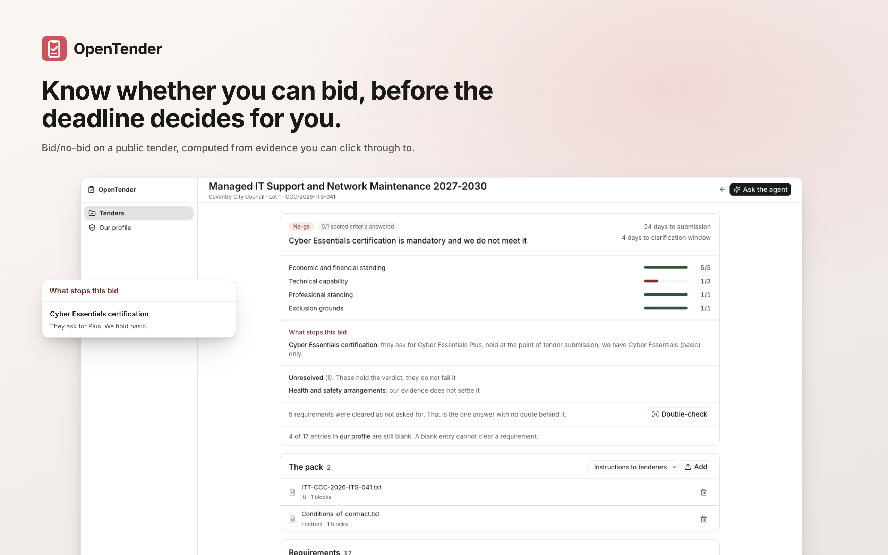
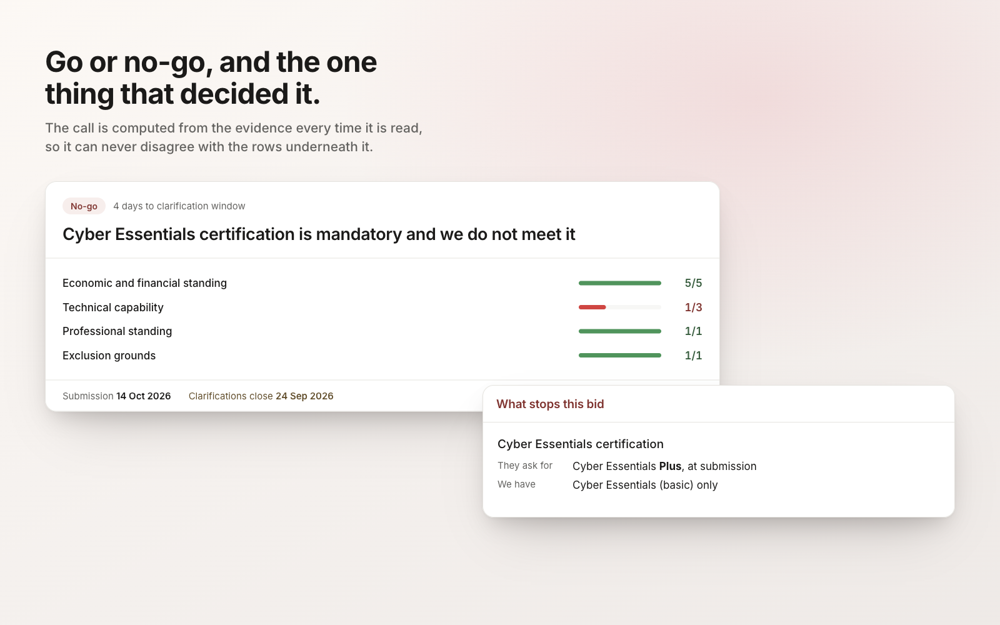
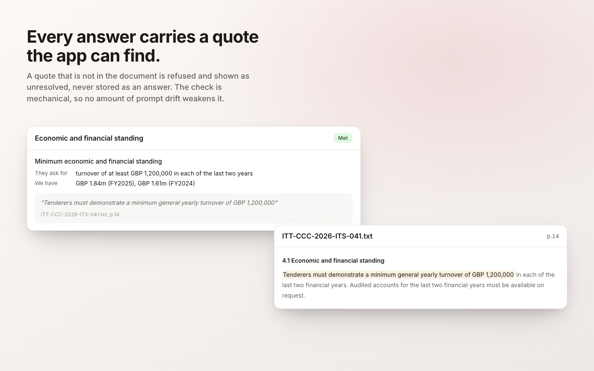
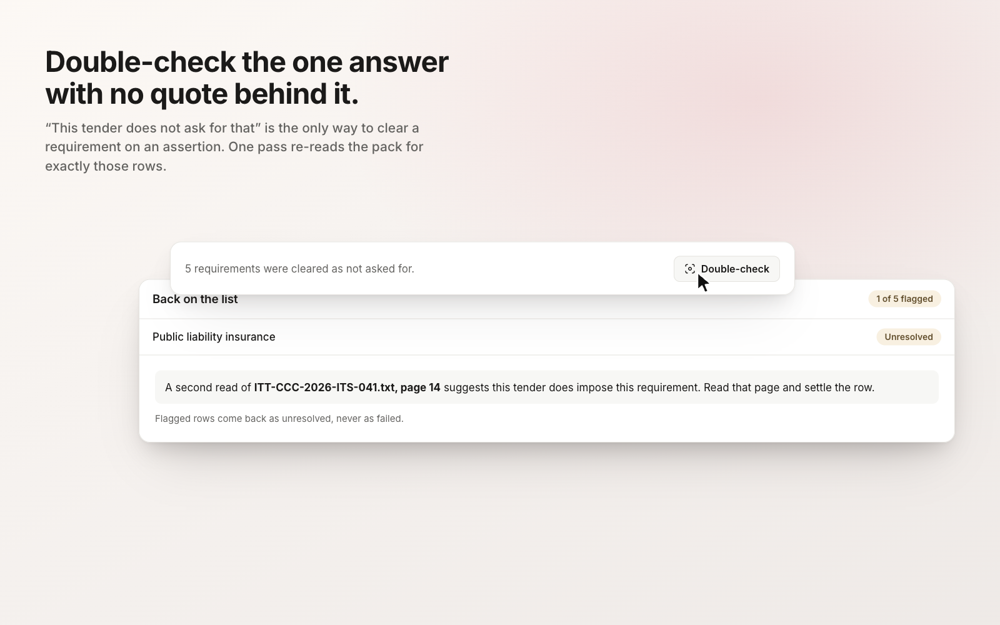
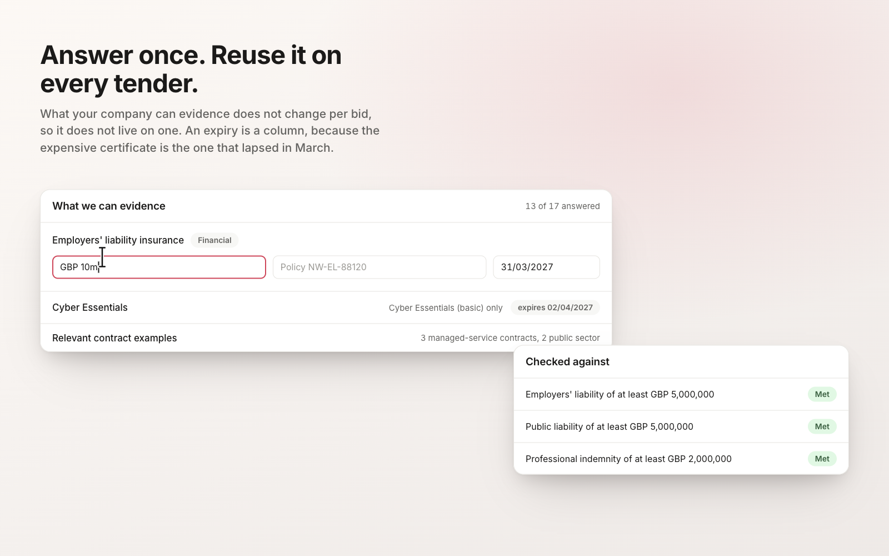

<picture>
  <source media="(prefers-color-scheme: dark)" srcset="readme-banner-dark.png" />
  
</picture>

# OpenTender: Open-Source Tender Qualification and Bid/No-Bid Software

[](https://app.clawnify.com/deploy?repo=clawnify/OpenTender)

Decide whether you can bid, before anyone writes a word of the bid. Most tender
tools help you write faster, but writing was never what lost the bid. One
mandatory certificate you do not hold, found on the afternoon of the deadline,
was. OpenTender reads the pack against what your company can actually evidence
and tells you go or no-go, naming the single requirement that decided it.

An open-source app template provided by [Clawnify](https://clawnify.com).

## See it in action

Conceptual UI illustrations of the app's main capabilities, with fictional
example data. Open an image to see the details.

| The bid/no-bid call | Evidence, not assertion |
| --- | --- |
| [](previews/verdict.png) | [](previews/citation.png) |
| **The second read** | **Answered once, reused every time** |
| [](previews/double-check.png) | [](previews/profile.png) |

## What it does

- **Loads a standard question set as rows.** The bundled UK pack is the Cabinet
  Office's own Annex B (PPN 03/24), with its source, publication date and
  licence recorded next to it. Start from it and delete what this tender does
  not ask for.
- **Keeps the two halves of the decision apart.** What the buyer demands is read
  out of their documents. What you can prove lives in a profile you fill in once
  and reuse on every tender. A requirement is only cleared when both exist.
- **Refuses a citation it cannot find.** Every answer must carry a quote copied
  from the pack. The app locates that quote in the extracted text before storing
  the answer; one it cannot find is shown as unresolved, never as an answer. The
  check is mechanical, so no amount of prompt drift weakens it.
- **Never stores the verdict.** It is recomputed from the evidence on every
  read, so it cannot quietly disagree with the rows underneath it.
- **Double-checks the one answer it cannot verify.** "This tender does not ask
  for that" is the only status with no quote behind it, so it is the only way
  to clear a mandatory requirement on an assertion. One button re-reads the
  pack for exactly those rows and puts back anything the text does impose after
  all, naming the page. A flagged row returns to unresolved, never to failed.
- **Counts both deadlines.** Submission, and the clarification window. The
  second one is the quieter loss: once it closes, an ambiguous requirement can
  no longer be asked about, only guessed at.
- **Records what you actually decided.** Teams bid on a technical no-go, and
  walk away from a clean go, for reasons no question set models. That goes in a
  note, not into editing the findings until the machine agrees.

## Who reads the pack

Your agent does. The app owns the record and the evidence check; reading three
hundred pages of procurement prose is judgment work that takes minutes, so it
runs on your agent and reports back through this app's own API. `agent.md` is
the contract it follows.

If no agent is reachable, the app hands you the same brief to paste into a chat.
It never becomes a dead end.

## Running it locally

```sh
pnpm install
pnpm dev          # UI on :5173, API on :8789
node demo/seed.mjs  # optional: fictional data to click around
```

`pnpm dev` needs Node 22 or later.

The double-check reads an `OPENROUTER_API_KEY`. On a deployed app it is
resolved for you and nothing needs doing. Locally, put it in
`.clawnify/.dev.vars`, not in the project root: the dev command generates its
config inside `.clawnify/` and secrets are read from beside that config. Leave
the key out entirely and everything else works; the double-check reports itself
as unavailable rather than failing.

## Deploy

Use the button above, or from a checkout:

```sh
pnpm deploy
```

## How it is put together

- **UI**: React and Vite, with a token layer in `src/client/styles.css`. Every
  colour and radius resolves through it, so rebranding is that one file.
- **API**: a Hono app in `src/server/index.ts`, self-describing at
  `/api/openapi.json` and `/llms.txt`.
- **Storage**: a SQLite database per deployment (`src/server/schema.sql`), and
  object storage for the original files.
- **The parts worth reading**: `src/server/citations.ts` is the quote check,
  `src/server/verdict.ts` is the bid/no-bid rule, and `src/server/decisions.ts`
  is the second read. All three are small, commented, and covered by tests
  (`pnpm test`).

## Adding a jurisdiction

A pack is one entry in `src/server/packs.gen.json`: an id, a name, its
provenance, and a list of requirements with a `key`, a `family`, an
`obligation` and a `hint` that says what to look for. Add a pack, keep the
provenance honest, and the rest of the app does not change.

The UK pack is reproduced under the Open Government Licence v3.0.

## Licence

MIT. See [LICENSE](LICENSE).
